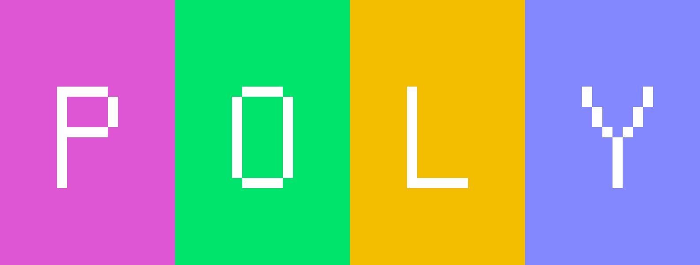
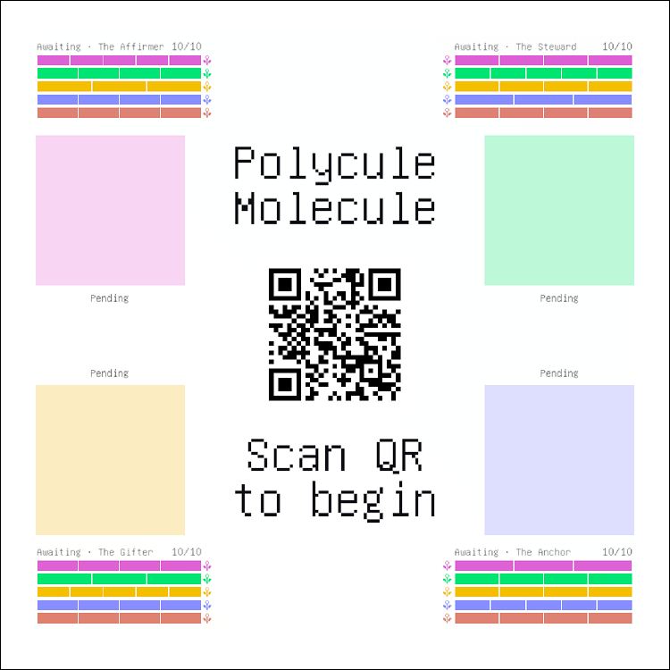
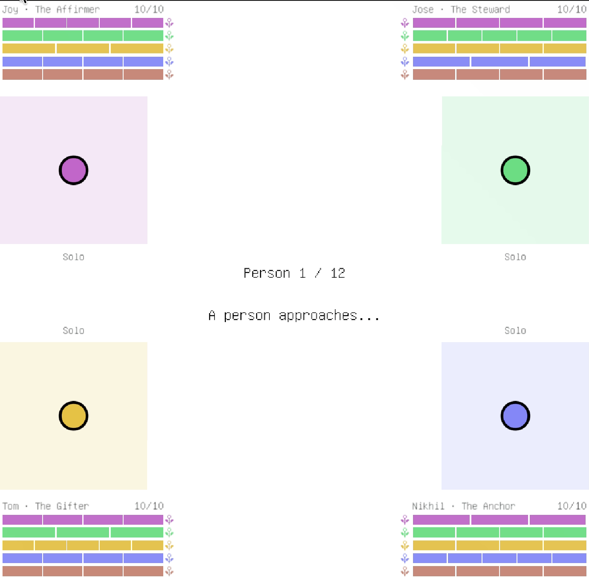
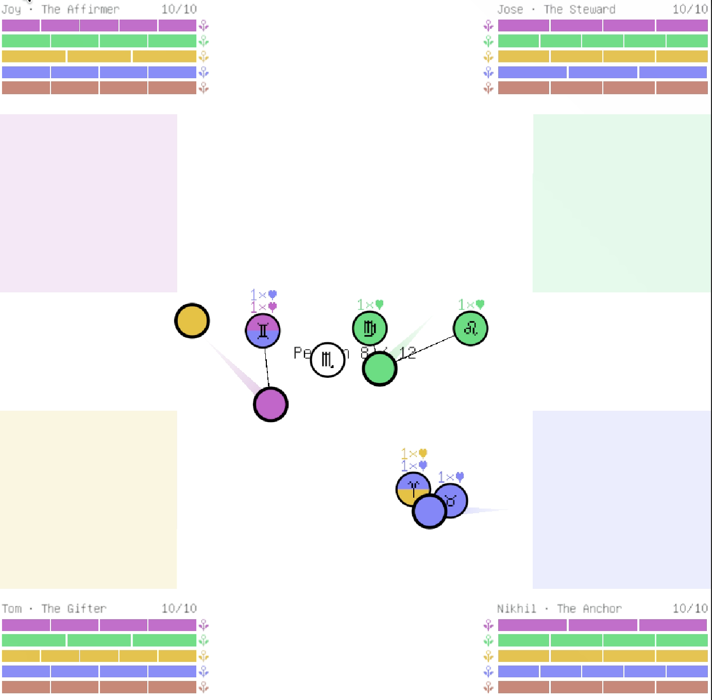
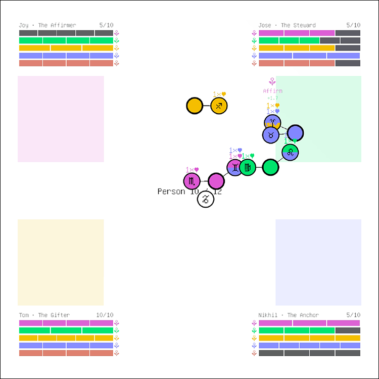
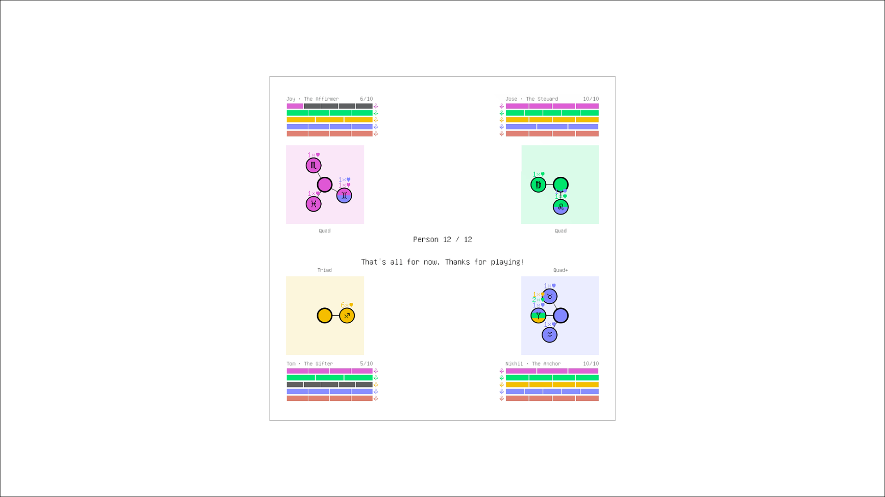
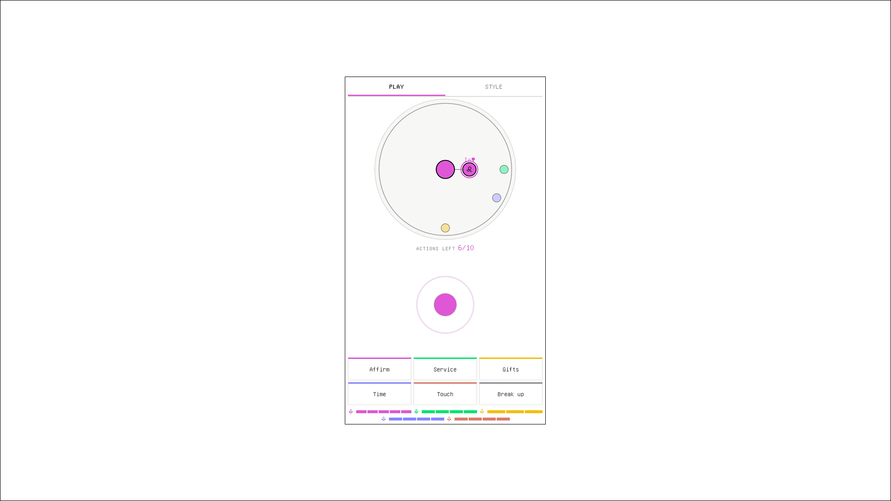
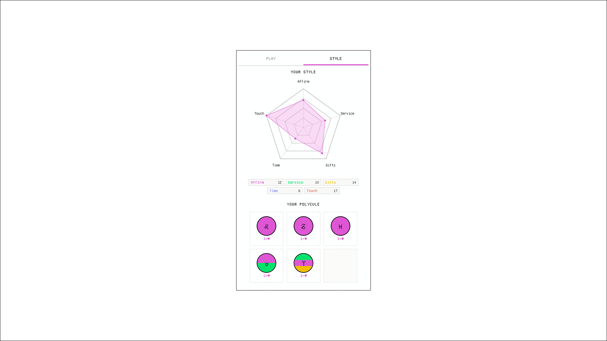

# Polycule Molecule

Polycule Molecule is a multiplayer relational building game where you court potential lovers using limited resources and form different bonds and connections with others. A top-down social simulation for 4 players exploring polyamorous relational dynamics through movement, proximity, and the five love languages. Players share a single screen while each using their own phone as a controller, and simultaneously court persona nodes that drift through a shared arena. Over each round, bonds form, decay, and branch into emergent network shapes.

> **Platform:** macOS only. Windows and Linux ports are planned for a future release.

## Videos

[](https://www.youtube.com/watch?v=6UW5uM0o4Oc)

[](https://www.youtube.com/watch?v=TQAZHHM-dMo)

---

## Screenshots







---

## Getting Started

> **Downloads:** The compiled build and Unity project files are hosted on Google Drive due to their size.

**Option A — Run the macOS build (no Unity required)**

1. Download and open `Polycule Molecule.app` from the Google Drive link above
2. The embedded server starts automatically on port 3847
3. A QR code appears on screen — scan it with your phone to connect

**Option B — Open through Unity**

Requirements:

- Unity **6000.3.6f1** (URP)
- TextMeshPro — import via `Window → TextMeshPro → Import TMP Essential Resources`
- Phones on the same Wi-Fi as the host machine (for LAN play) — see [Phone Controllers & Networking](#phone-controllers--networking) for internet play via ngrok

Steps:

1. Open `Unity_Files/` in Unity Hub
2. Open `Assets/Scenes/SampleScene`
3. Press **Play** — everything bootstraps automatically

> If text renders as boxes, go to `Edit → Project Settings → TextMeshPro → Settings` and set `Assets/Fonts/unifont SDF` as the default font asset.

## How to Play

**The Field**

Four players — **The Affirmer**, **The Steward**, **The Gifter**, and **The Anchor** — move simultaneously through a shared arena. One persona node appears per round and drifts through the field. To court a persona, walk up to it and spend love language actions while within proximity range.

**Controls**

All input is handled through the phone controller. At the title screen a QR code appears — scan it on your phone to claim a player slot. The phone acts as a joystick and action pad: move with the on-screen thumbstick and tap love language buttons to interact with nearby personas.

## The Five Love Languages

Each action spends one unit of the matching resource. Resources replenish each round.

| Action      | What it represents                                  |
| ----------- | --------------------------------------------------- |
| **Affirm**  | Words of affirmation — verbal validation and praise |
| **Service** | Acts of service — doing things for someone          |
| **Gifts**   | Receiving gifts — material expressions of care      |
| **Time**    | Quality time — sustained presence and attention     |
| **Touch**   | Physical touch — closeness and physical affection   |

A sixth action, **Break up**, ends an existing bond with a persona.

## Player Archetypes

Each archetype starts with a different distribution of love language resources, shaping their natural approach. The tension — your strongest resource may not match a persona's hidden propensities — is the core strategic dilemma.

| Archetype        | Strongest resource   |
| ---------------- | -------------------- |
| **The Affirmer** | Words of affirmation |
| **The Steward**  | Acts of service      |
| **The Gifter**   | Receiving gifts      |
| **The Anchor**   | Quality time         |

## Round Structure

Each round is marked by a zodiac glyph, one per round in order: ♈︎ ♉︎ ♊︎ ♋︎ ♌︎ ♍︎ ♎︎ ♏︎ ♐︎ ♑︎ ♒︎ ♓︎

1. **Spawn** — A persona arrives with a name, two traits, a mood, a story, and hidden love-language propensities (ranging from strongly positive to negative)
2. **Courting** — All players move freely; actions fire when in proximity. Each player has **10 actions per turn**
3. **Resolution** — `affinity delta = action × persona propensity`. A bond forms once affinity reaches threshold (**6**). Idle bonds decay over time
4. **Negotiation** — A brief pause to discuss the round, inspect revealed propensities, and plan next moves

After 12 rounds the end-game dashboard shows bond counts, network typology, and cumulative affinity per player-persona pair.

## Bonds & Network Typology

Bonds render as glowing edges between player nodes and persona nodes in a live spring-physics network. A persona can bond with multiple players; shared bonds appear as multi-colored band edges.

| Typology | Description                                    |
| -------- | ---------------------------------------------- |
| Solo     | One player, no bonds                           |
| Couple   | One persona bonded to one player               |
| Triad    | One persona bonded to two players              |
| Quad     | One persona bonded to three or four players    |
| Quad+    | Multiple shared connections across the network |

## Phone Controllers & Networking

The game runs an embedded HTTP + WebSocket server on **port 3847** the moment Play is pressed — no Node.js or external server setup required.

**Default: LAN (same Wi-Fi)**

By default, the QR code encodes the host machine's local network IP. Players must be on the same Wi-Fi as the machine running the game. This is the only connection mode available out of the box; no configuration needed.

**Extended: Internet play via ngrok**

For play across different networks — including remote participants or public playtesting — the build supports tunneling through [ngrok](https://ngrok.com). When a tunnel is active, the QR code automatically encodes the public HTTPS URL instead of the LAN IP.

The game discovers an active tunnel through three fallback steps:

1. Checks if ngrok is already running locally (polls `localhost:4040/api/tunnels`)
2. If not found, attempts to auto-launch the ngrok CLI using credentials in `ngrok.local.env`
3. If no tunnel can be established, falls back to the LAN IP

**Setting up `ngrok.local.env`**

Create a file named `ngrok.local.env` in the `WebController` directory (next to `server.js`). Unity does not inherit terminal environment variables, so credentials must be specified here:

```
# Required to auto-launch ngrok from within Unity
NGROK_AUTHTOKEN=your_token_here

# Full path to the ngrok binary — needed because Unity may not see your shell PATH
# Find it with: which ngrok
NGROK_EXE=/opt/homebrew/bin/ngrok

# Optional: reserve a stable domain from your ngrok dashboard
NGROK_DOMAIN=yourname.ngrok-free.dev

# Optional: hardcode a public URL instead of auto-discovering
# PUBLIC_CONTROLLER_URL=https://yourname.ngrok-free.dev
```

> The authtoken is available at [dashboard.ngrok.com/authtokens](https://dashboard.ngrok.com/authtokens). The `NGROK_EXE` path is almost always required on macOS since Unity spawns processes outside the shell environment and won't find binaries installed via Homebrew or nvm unless the path is explicit.




## Research Context

_Polycule Molecule_ is a design research prototype created for DESIGN 6197: Games in Research at Cornell University. The game uses play as a method to model and interrogate polyamorous relational structures — examining how the five love languages, asymmetric emotional resources, and hidden compatibility shape the networks people build together. The emergent typologies (Couple, Triad, Quad, Polycule) are not predetermined outcomes but consequences of player choices, resource constraints, and chance.

## Thematic Analysis — Playtesting Findings

> **Root theme:** _Meaning-Making in an Opaque, Scarcity-Driven Relational Economy_
> Players impose narrative, identity, and strategy onto limited information, randomized symbols, and simultaneous action.

[](https://www.youtube.com/watch?v=h4BhAhwitGY)

### Level 1 — Strategic Adaptation

_How players actually navigate the system_

#### Action Spamming / Trial-and-Error Heuristic

> "Honestly, I just quickly try to loop through the four actions… I was just tapping everything really quickly to see."
>
> "I just spam everything."
>
> "I just go up to them and I just spam…"
>
> "I just spam all of us."

#### Gradual Mechanic Discovery

> "I was trying to do the thing of picking up someone else's player, but I wasn't sure. Do you have to just be really proximally close…?"
>
> "Did you know there was a merge button?"
>
> "You kind of have to select the new person on the map first."
>
> "I wasn't sure how to do the sharing."

---

### Level 2 — Emotional & Relational Projection

_Players project personal and cultural meaning onto the game_

#### Possessiveness & Competitive Framing

> "I was very possessive around my one to two people…"
>
> "Matthew is playing very greedy." / "If you court my partner, I'm going to court you back so hard."
>
> "I feel like I took more of a competitive approach…"

#### Personification & Apophenia (incl. Zodiac)

> "They're zodiac symbols… you just dated the entire zodiac." / "So the zodiac sign… dictate what the vibes are?"
>
> "Leo is out here being Sean from society."

#### Identity Mirroring & Real-Life Insertion

> "I'm actually monogamous."
>
> "I'm like a sugar daddy." / "Nobody loves me." / "What does it mean that I'm going to die alone, guys?"
>
> "You and I are attached." / "That's my wife."

---

### Level 3 — Social & Cooperative Tension

_Group dynamics and the pull between competition and cooperation_

#### Surprise & Friction of Cooperative Features

> "You have to be in synchronicity."
>
> "How do we merge into one person?"
>
> "We can merge into a safe prison. We can fall in love."

#### Queer / Poly Aesthetic Resonance

> "It kind of looks like the bisexual flag too." / "That's like perfect, that's like bisexuality right there."

---

### Level 4 — System Friction & Pacing Effects

_How the rules shape — or frustrate — behavior_

#### Learning Curve vs. Round Length

> "The time is too short. Because at the beginning, I'm confused… the time is stopped."
>
> "Out of desperation, I'm like maybe I'll get…"

#### Attention Split (Phone vs. Screen)

> "I kind of miss the… should my attention always be focused on my game controller on the phone or should it be focused on the main screen?"
